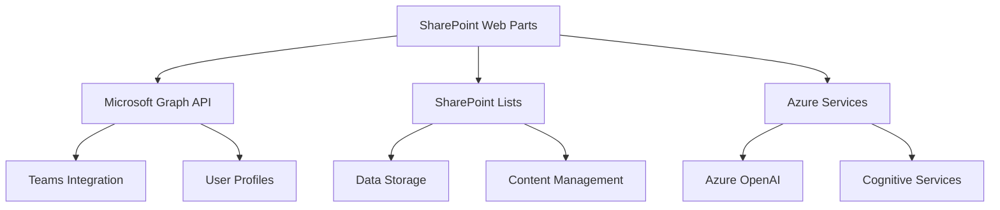

# SharePoint Product Bundle Overview

## Introduction

This SharePoint product bundle provides a comprehensive suite of modern web parts designed to enhance productivity, collaboration, and operational efficiency within your organization. Built using the SharePoint Framework (SPFx) with React and Fluent UI, each web part offers enterprise-grade functionality with seamless Microsoft 365 integration.

## Web Parts Portfolio

### 1. External User Manager
**Location**: `/src/webparts/externalUserManager/`

The foundational web part for managing external users and document libraries in SharePoint. This web part provides administrators with comprehensive tools to oversee external sharing, user permissions, and security compliance.

**Key Features**:
- External user discovery and management
- Library-level permission control
- Audit logging and compliance reporting
- Integration with Microsoft Graph API
- Real-time security monitoring

**Use Cases**: SharePoint administrators, IT security teams, compliance officers

---

### 2. Timesheet Management
**Location**: `/src/webparts/timesheetManagement/`  
**Documentation**: [Timesheet Management README](../src/webparts/timesheetManagement/README.md)

A comprehensive time tracking solution that enables employees to submit timesheets and managers to approve time entries efficiently. Perfect for organizations requiring detailed time tracking for billing, payroll, or project management.

**Key Features**:
- Weekly timesheet creation and submission
- Project-based time tracking
- Multi-level approval workflows
- Integration with payroll systems
- Advanced reporting and analytics

**Use Cases**: Professional services, consulting firms, project-based organizations

---

### 3. Inventory & Product Catalog
**Location**: `/src/webparts/inventoryProductCatalog/`  
**Documentation**: [Inventory & Product Catalog README](../src/webparts/inventoryProductCatalog/README.md)

An intelligent inventory management system that provides real-time stock tracking, automated alerts, and comprehensive product catalog management. Ideal for organizations managing physical inventory, equipment, or product catalogs.

**Key Features**:
- Real-time stock level monitoring
- Automated low-stock and out-of-stock alerts
- Multi-location inventory tracking
- Supplier management and integration
- Barcode scanning capabilities (planned)

**Use Cases**: Retail operations, warehouse management, equipment tracking, manufacturing

---

### 4. AI-Powered FAQ & Knowledge Base
**Location**: `/src/webparts/aiPoweredFaq/`  
**Documentation**: [AI-Powered FAQ & Knowledge Base README](../src/webparts/aiPoweredFaq/README.md)

A cutting-edge knowledge management solution powered by Azure AI services. This web part transforms traditional FAQ systems by providing intelligent answer generation, smart content suggestions, and conversational AI capabilities.

**Key Features**:
- Azure OpenAI integration for intelligent responses
- Conversational AI chat interface
- Smart content categorization and tagging
- Real-time confidence scoring
- Multi-language support and translation

**Use Cases**: Customer support, HR self-service, IT helpdesk, training and onboarding

---

### 5. Meeting Room & Resource Booking
**Location**: `/src/webparts/meetingRoomBooking/`  
**Documentation**: [Meeting Room & Resource Booking README](../src/webparts/meetingRoomBooking/README.md)

A comprehensive facility management solution that streamlines room reservations, equipment booking, and resource allocation. Seamlessly integrated with Microsoft Teams for hybrid meeting experiences.

**Key Features**:
- Real-time room availability checking
- Microsoft Teams meeting auto-generation
- Equipment and resource reservation
- Recurring booking patterns
- Interactive floor plans and navigation

**Use Cases**: Facility management, meeting coordination, hybrid workplace optimization

## Technology Stack

### Core Technologies
- **SharePoint Framework (SPFx)**: 1.18.2
- **React**: 17.0.1 with TypeScript for type safety
- **Fluent UI**: 8.x for consistent Microsoft design language
- **SCSS Modules**: Component-scoped styling
- **Microsoft Graph API**: Deep Microsoft 365 integration

### Cloud Services Integration
- **Azure OpenAI**: Intelligent content generation and analysis
- **Microsoft Teams**: Collaboration and communication features
- **SharePoint Online**: Data storage and document management
- **Power Platform**: Workflow automation and advanced analytics
- **Azure Cognitive Services**: AI-powered content analysis

### Development Tools
- **TypeScript**: Enhanced code quality and developer experience
- **Gulp**: Build automation and task management
- **ESLint**: Code quality and consistency enforcement
- **Node.js**: Development environment and build tools

## Architecture Overview

### Design Principles
1. **Modular Architecture**: Each web part is self-contained with clear interfaces
2. **Consistent UI/UX**: Shared design patterns using Fluent UI components
3. **Scalable Data Layer**: Efficient SharePoint List integration with caching
4. **Progressive Enhancement**: Core functionality with optional advanced features
5. **Mobile-First Design**: Responsive layouts optimized for all devices

### Integration Patterns


### Security Framework
- **Azure AD Integration**: Single sign-on and identity management
- **Role-Based Access Control**: Granular permissions per web part
- **API Security**: Secure token management and encrypted communications
- **Compliance**: GDPR, SOX, and industry-specific compliance features
- **Audit Logging**: Comprehensive activity tracking and reporting

## Deployment Guide

### Prerequisites
- SharePoint Online tenant with modern sites enabled
- SharePoint Framework development environment
- Node.js 16.x or 18.x (SPFx 1.18.2 compatibility)
- Azure subscription for AI services (optional but recommended)
- Global administrator or SharePoint administrator permissions

### Installation Process

1. **Environment Setup**
   ```bash
   # Install required tools
   npm install -g yo @microsoft/generator-sharepoint
   
   # Clone repository
   git clone <repository-url>
   cd sharepoint-external-user-manager
   
   # Install dependencies
   npm install
   ```

2. **Build and Package**
   ```bash
   # Build all web parts
   npm run build
   
   # Create deployment package
   npm run package-solution
   ```

3. **Deploy to SharePoint**
   - Upload `.sppkg` file to SharePoint App Catalog
   - Grant API permissions in SharePoint Admin Center
   - Deploy to specific sites or tenant-wide

4. **Configure Web Parts**
   - Add web parts to SharePoint pages
   - Configure web part properties and settings
   - Set up Azure AI services (for AI-powered features)
   - Configure Teams integration permissions

### Phased Deployment Strategy

#### Phase 1: Core Foundation (Weeks 1-2)
- Deploy External User Manager for security and compliance
- Set up basic data structures and permissions
- Train administrators on core functionality

#### Phase 2: Productivity Tools (Weeks 3-4)
- Deploy Timesheet Management for time tracking
- Roll out Inventory & Product Catalog for asset management
- Configure approval workflows and integrations

#### Phase 3: Advanced Features (Weeks 5-6)
- Deploy AI-Powered FAQ with Azure OpenAI configuration
- Implement Meeting Room & Resource Booking with Teams integration
- Enable advanced analytics and reporting features

#### Phase 4: Optimization (Weeks 7-8)
- Fine-tune AI models and responses
- Optimize performance and user experience
- Implement advanced workflow automations

## Configuration Management

### Global Settings
Each web part supports organization-wide configuration through SharePoint tenant properties:

```typescript
// Example tenant configuration
const tenantConfig = {
  organization: {
    name: "Contoso Corporation",
    timeZone: "UTC-8",
    currency: "USD",
    locale: "en-US"
  },
  features: {
    enableAI: true,
    enableTeamsIntegration: true,
    enableAdvancedAnalytics: true
  },
  security: {
    requireMFA: true,
    auditLevel: "detailed",
    dataRetentionDays: 2555 // 7 years
  }
};
```

### Web Part Specific Configuration
- **Timesheet Management**: Approval workflows, billing rates, project codes
- **Inventory Catalog**: Alert thresholds, supplier integrations, barcode settings
- **AI FAQ**: Azure OpenAI endpoints, confidence thresholds, response limits
- **Room Booking**: Teams integration, approval policies, resource types

## Integration Capabilities

### Microsoft 365 Ecosystem
- **SharePoint**: Native data storage and document management
- **Teams**: Real-time collaboration and communication
- **Outlook**: Calendar integration and email notifications
- **Power Platform**: Advanced workflows and business intelligence
- **Viva Suite**: Employee experience and productivity insights

### Third-Party Systems
- **ERP Systems**: SAP, Oracle, Microsoft Dynamics integration
- **HR Systems**: Workday, BambooHR, ADP connectivity
- **Communication Tools**: Slack, Zoom, WebEx compatibility
- **Analytics Platforms**: Tableau, Power BI, custom dashboards

### API Framework
```typescript
// Standardized API interface for all web parts
interface IWebPartAPI {
  getData(): Promise<any>;
  createItem(item: any): Promise<any>;
  updateItem(id: string, updates: any): Promise<any>;
  deleteItem(id: string): Promise<void>;
  getAnalytics(): Promise<any>;
}
```

## User Roles and Permissions

### Administrator Roles
- **Global Admin**: Full access to all web parts and configuration
- **SharePoint Admin**: Web part deployment and site-level configuration
- **Security Admin**: Audit logs, compliance reporting, user management
- **AI Admin**: Azure AI service configuration and model management

### Business User Roles
- **Manager**: Approval workflows, team oversight, reporting access
- **Employee**: Standard web part usage, data entry, personal dashboards
- **Viewer**: Read-only access to relevant information and reports
- **Guest**: Limited access to specific features (external collaboration)

### Permission Matrix
| Feature | Global Admin | SharePoint Admin | Manager | Employee | Viewer | Guest |
|---------|-------------|------------------|---------|----------|--------|-------|
| External User Management | ✅ | ✅ | ❌ | ❌ | ❌ | ❌ |
| Timesheet Approval | ✅ | ✅ | ✅ | ❌ | ❌ | ❌ |
| Inventory Management | ✅ | ✅ | ✅ | ✅ | ✅ | ❌ |
| AI FAQ Management | ✅ | ✅ | ✅ | ✅ | ✅ | ✅ |
| Room Booking | ✅ | ✅ | ✅ | ✅ | ✅ | ⚠️ |

## Analytics and Reporting

### Built-in Analytics
Each web part includes comprehensive analytics capabilities:

- **Usage Metrics**: User adoption, feature utilization, performance indicators
- **Business Intelligence**: Custom dashboards, trend analysis, predictive insights
- **Compliance Reporting**: Audit trails, security events, regulatory compliance
- **Performance Monitoring**: Response times, error rates, system health

### Power BI Integration
Pre-built Power BI templates for each web part:
- Executive dashboard with KPIs across all web parts
- Departmental views for specific business functions
- Compliance and security monitoring dashboards
- User adoption and training effectiveness reports

### Custom Analytics
```typescript
// Analytics event tracking
interface IAnalyticsEvent {
  webPart: string;
  action: string;
  user: string;
  timestamp: Date;
  metadata: any;
}

// Example usage
analytics.trackEvent({
  webPart: 'TimesheetManagement',
  action: 'SubmitTimesheet',
  user: context.pageContext.user.email,
  timestamp: new Date(),
  metadata: { projectId: 'PRJ-001', hours: 40 }
});
```

## Support and Maintenance

### Documentation Resources
- Individual web part README files with detailed setup instructions
- API documentation and integration guides
- Video tutorials and training materials
- Best practices and troubleshooting guides

### Support Channels
- **Technical Support**: Email, Teams channels, ServiceNow tickets
- **Community Forum**: SharePoint community discussions and Q&A
- **Training Resources**: Online courses, webinars, documentation portal
- **Professional Services**: Custom implementation and consultation

### Maintenance Schedule
- **Monthly**: Security updates, bug fixes, minor enhancements
- **Quarterly**: Feature updates, performance optimizations
- **Annually**: Major version releases, architectural improvements
- **As-needed**: Critical security patches, urgent bug fixes

## Cost Considerations

### Licensing Requirements
- **SharePoint Online**: Required for all users accessing web parts
- **Microsoft Teams**: Required for Teams integration features
- **Azure OpenAI**: Pay-per-use for AI-powered features
- **Power Platform**: Optional for advanced workflows and analytics

### Implementation Costs
- Initial deployment and configuration: 2-4 weeks
- User training and change management: 1-2 weeks
- Custom integrations and modifications: Variable
- Ongoing maintenance and support: 10-20% of implementation cost annually

### ROI Expectations
- **Timesheet Management**: 15-25% reduction in administrative overhead
- **Inventory Catalog**: 10-20% reduction in inventory carrying costs
- **AI FAQ**: 30-50% reduction in support ticket volume
- **Room Booking**: 20-30% improvement in space utilization

## Future Roadmap

### Short-term Enhancements (6 months)
- Enhanced mobile applications for all web parts
- Advanced AI capabilities with custom model training
- Expanded third-party integrations and connectors
- Performance optimizations and user experience improvements

### Medium-term Developments (12 months)
- Predictive analytics and machine learning insights
- Voice-activated interfaces and natural language processing
- Augmented reality features for inventory and facility management
- Blockchain integration for audit trails and compliance

### Long-term Vision (18-24 months)
- Fully automated workflows with minimal human intervention
- Comprehensive digital workplace platform integration
- Advanced IoT sensor integration for real-time data
- Cross-platform mobile applications with offline capabilities

## Getting Started

### Quick Start Guide
1. **Start with External User Manager**: Establish security foundation
2. **Add Timesheet Management**: Implement time tracking for immediate ROI
3. **Deploy Inventory Catalog**: Gain control over organizational assets
4. **Configure AI FAQ**: Reduce support overhead with intelligent responses
5. **Implement Room Booking**: Optimize space utilization and hybrid work

### Success Metrics
- **User Adoption**: Target 80% adoption within 90 days
- **Process Efficiency**: Measure time savings and error reduction
- **Cost Savings**: Track ROI through reduced administrative overhead
- **User Satisfaction**: Regular surveys and feedback collection
- **Security Compliance**: Monitor audit success rates and compliance scores

### Training and Adoption
- **Administrator Training**: 2-day intensive training for IT staff
- **End User Training**: 4-hour sessions for business users
- **Change Management**: Structured adoption program with champions
- **Ongoing Support**: Regular office hours and Q&A sessions

---

## Contact Information

For questions about this product bundle or specific web parts, please refer to the individual README files in each web part directory or contact your SharePoint administrator.

### Web Part Links
- [External User Manager](../src/webparts/externalUserManager/) - Core security and compliance
- [Timesheet Management](../src/webparts/timesheetManagement/README.md) - Time tracking and approval
- [Inventory & Product Catalog](../src/webparts/inventoryProductCatalog/README.md) - Asset and inventory management
- [AI-Powered FAQ & Knowledge Base](../src/webparts/aiPoweredFaq/README.md) - Intelligent knowledge management
- [Meeting Room & Resource Booking](../src/webparts/meetingRoomBooking/README.md) - Facility and resource management

### Additional Resources
- [Architecture Documentation](../ARCHITECTURE.md)
- [Developer Guide](../DEVELOPER_GUIDE.md)
- [Technical Documentation](../TECHNICAL_DOCUMENTATION.md)
- [Implementation Summary](../IMPLEMENTATION_SUMMARY.md)