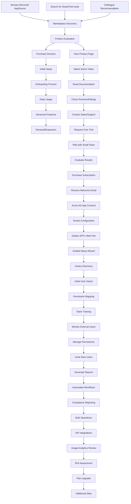

# User Journey & Onboarding

## Overview

This document outlines the user journey and onboarding process for marketplace buyers of the SharePoint External User Manager SaaS solution.

## Target Personas

### 1. IT Administrator
- **Role**: Tenant administrator or SharePoint admin
- **Goals**: Enable external collaboration, maintain security, ensure compliance
- **Pain Points**: Complex SharePoint permissions, external user sprawl, lack of visibility

### 2. Business User
- **Role**: Site owner, project manager, business stakeholder
- **Goals**: Collaborate with external partners, share documents securely
- **Pain Points**: Difficult external user management, permission complexity

### 3. Compliance Officer
- **Role**: Security or compliance team member
- **Goals**: Audit external access, ensure data protection, risk management
- **Pain Points**: Lack of external user visibility, audit trail gaps

## User Journey Diagram



## Detailed Journey Stages

### Stage 1: Marketplace Discovery (Days 0-3)

#### Touchpoints
- **Microsoft AppSource**: Primary discovery channel
- **Search Results**: "SharePoint external users", "guest user management"
- **Partner Recommendations**: Microsoft partners and consultants
- **Community Forums**: SharePoint community discussions

#### User Actions
1. Browse AppSource categories
2. Search for SharePoint solutions
3. Compare similar products
4. Read product descriptions and reviews

#### Key Success Metrics
- Product page views
- Demo video completion rate
- Documentation downloads
- Contact form submissions

### Stage 2: Product Evaluation (Days 3-14)

#### Information Gathering
```
┌─────────────────────────────────────────────────────────────┐
│                    Product Evaluation                       │
├─────────────────────────────────────────────────────────────┤
│                                                             │
│  📄 Product Overview                                        │
│  ├─ Feature list and capabilities                           │
│  ├─ Pricing and subscription plans                          │
│  ├─ Security and compliance information                     │
│  └─ Integration requirements                                │
│                                                             │
│  🎥 Demo & Documentation                                    │
│  ├─ Product demo video (5-10 minutes)                       │
│  ├─ Technical documentation                                 │
│  ├─ Implementation guide                                    │
│  └─ FAQ and troubleshooting                                │
│                                                             │
│  👥 Social Proof                                           │
│  ├─ Customer testimonials                                   │
│  ├─ Case studies                                           │
│  ├─ AppSource reviews and ratings                          │
│  └─ Reference customers                                     │
│                                                             │
│  🔧 Technical Validation                                    │
│  ├─ System requirements check                               │
│  ├─ Permission requirements review                          │
│  ├─ Security assessment                                     │
│  └─ Integration feasibility                                │
│                                                             │
└─────────────────────────────────────────────────────────────┘
```

#### Evaluation Criteria Checklist
- [ ] **Functionality**: Meets external user management needs
- [ ] **Security**: Complies with organizational security policies
- [ ] **Integration**: Works with existing SharePoint environment
- [ ] **Usability**: Easy to use for both IT and business users
- [ ] **Support**: Adequate documentation and customer support
- [ ] **Pricing**: Fits within budget constraints
- [ ] **Scalability**: Can grow with organizational needs

### Stage 3: Purchase & Initial Setup (Days 14-21)

#### Purchase Process
1. **Free Trial Request** (Optional)
   - 30-day trial period
   - Limited to 5 libraries and 25 external users
   - Full feature access

2. **Subscription Purchase**
   - Choose appropriate plan (Starter/Professional/Enterprise)
   - Complete payment through Microsoft
   - Receive license and access credentials

#### Initial Setup Workflow
```
┌─────────────────────────────────────────────────────────────┐
│                    Setup Workflow                           │
├─────────────────────────────────────────────────────────────┤
│                                                             │
│  Step 1: Welcome & Prerequisites                            │
│  ├─ Welcome email with setup instructions                   │
│  ├─ Prerequisites checklist                                 │
│  ├─ Required permissions verification                       │
│  └─ Support contact information                             │
│                                                             │
│  Step 2: Azure AD App Registration                          │
│  ├─ Admin consent for application permissions               │
│  ├─ Multi-tenant application setup                          │
│  ├─ API permissions configuration                           │
│  └─ Security validation                                     │
│                                                             │
│  Step 3: SPFx Web Part Deployment                          │
│  ├─ Download web part package                               │
│  ├─ Upload to SharePoint App Catalog                        │
│  ├─ Deploy to selected sites                                │
│  └─ Initial configuration                                   │
│                                                             │
│  Step 4: Backend Service Configuration                      │
│  ├─ Tenant registration in backend system                   │
│  ├─ API endpoint configuration                              │
│  ├─ Authentication setup                                    │
│  └─ Initial data synchronization                            │
│                                                             │
└─────────────────────────────────────────────────────────────┘
```

### Stage 4: Onboarding Process (Days 21-35)

#### Guided Setup Wizard
The onboarding process includes an interactive setup wizard:

```typescript
interface OnboardingStep {
  id: string;
  title: string;
  description: string;
  estimatedTime: number; // minutes
  required: boolean;
  status: 'pending' | 'in-progress' | 'completed' | 'skipped';
}

const onboardingSteps: OnboardingStep[] = [
  {
    id: 'discovery',
    title: 'Library Discovery',
    description: 'Scan your SharePoint environment for existing libraries with external sharing',
    estimatedTime: 5,
    required: true,
    status: 'pending'
  },
  {
    id: 'user-import',
    title: 'External User Import',
    description: 'Import existing external users and their permissions',
    estimatedTime: 10,
    required: true,
    status: 'pending'
  },
  {
    id: 'permission-mapping',
    title: 'Permission Mapping',
    description: 'Map SharePoint permissions to standardized levels',
    estimatedTime: 15,
    required: true,
    status: 'pending'
  },
  {
    id: 'notification-setup',
    title: 'Notification Setup',
    description: 'Configure email notifications and alerts',
    estimatedTime: 5,
    required: false,
    status: 'pending'
  },
  {
    id: 'team-training',
    title: 'Team Training',
    description: 'Schedule training sessions for your team',
    estimatedTime: 30,
    required: false,
    status: 'pending'
  }
];
```

#### Onboarding Success Criteria
- [ ] At least 1 library successfully configured
- [ ] At least 1 external user imported or invited
- [ ] Admin user completes training module
- [ ] First successful permission change
- [ ] First report generated

### Stage 5: Daily Usage (Days 35+)

#### Common User Workflows

1. **Monitor External Access** (Daily)
   - Review dashboard with external user metrics
   - Check for new external users
   - Monitor permission changes
   - Review access patterns

2. **Manage User Permissions** (Weekly)
   - Update user permissions based on project needs
   - Remove access for completed projects
   - Invite new external users
   - Bulk permission updates

3. **Generate Reports** (Monthly)
   - External user access reports
   - Permission audit reports
   - Usage analytics
   - Compliance reports

4. **Maintain Security** (Ongoing)
   - Review external sharing settings
   - Monitor for security alerts
   - Update permission policies
   - Conduct access reviews

### Stage 6: Advanced Features Adoption (Days 60+)

#### Feature Progression
```
Basic Usage → Advanced Features → Power User
     ↓              ↓              ↓
- View users  → - Automation  → - API usage
- Basic perms → - Workflows   → - Custom apps
- Simple rpts → - Bulk ops    → - Integrations
```

#### Advanced Features Timeline
- **Month 2**: Automated workflows and notifications
- **Month 3**: Advanced reporting and analytics
- **Month 4**: Bulk operations and API usage
- **Month 6**: Custom integrations and extensions

## Onboarding Success Metrics

### Time to Value Metrics
- **Time to First Success**: User completes first permission change
- **Time to Regular Usage**: User performs 5+ actions per week
- **Time to Advanced Features**: User adopts automation/workflows

### Adoption Metrics
- **Feature Adoption Rate**: % of users using each feature
- **User Engagement**: Daily/weekly active users
- **Support Ticket Volume**: Decrease over time indicates successful onboarding

### Business Impact Metrics
- **External User Visibility**: % increase in tracked external users
- **Permission Accuracy**: Reduction in over-privileged access
- **Time Savings**: Hours saved on manual user management

## Support & Training Resources

### 1. Self-Service Resources
- **Getting Started Guide**: Step-by-step setup instructions
- **Video Tutorials**: Feature-specific how-to videos
- **Knowledge Base**: Searchable FAQ and troubleshooting
- **Community Forum**: User community for questions and tips

### 2. Assisted Onboarding
- **Welcome Call**: 30-minute orientation call with customer success
- **Setup Assistance**: Screen-sharing session for complex configurations
- **Training Sessions**: Live or recorded training for teams
- **Check-in Calls**: 30, 60, 90-day success check-ins

### 3. Documentation Library
- **Admin Guide**: Complete administrator documentation
- **User Guide**: End-user documentation with screenshots
- **API Documentation**: Developer resources for integrations
- **Best Practices**: Recommended configurations and workflows

## Marketplace Buyer Journey Optimization

### Key Optimization Areas

1. **Reduce Friction**
   - Minimize steps from discovery to value
   - Automate configuration where possible
   - Provide clear progress indicators

2. **Increase Confidence**
   - Transparent pricing and feature information
   - Strong social proof and testimonials
   - Risk-free trial period

3. **Accelerate Value**
   - Quick wins in first session
   - Progressive feature disclosure
   - Context-sensitive help

4. **Enable Success**
   - Comprehensive documentation
   - Multiple support channels
   - Regular success check-ins

### Success Indicators

#### Early Success (Days 1-30)
- Successful app installation and configuration
- First external user managed
- Admin team trained on basic features

#### Ongoing Success (Days 30-90)
- Regular platform usage (weekly active users)
- Multiple libraries under management
- Reports generated and acted upon

#### Long-term Success (Days 90+)
- Advanced features adopted
- Integration with business processes
- Measurable business impact achieved
- High user satisfaction scores

This comprehensive onboarding approach ensures marketplace buyers can quickly realize value from the SharePoint External User Manager while building confidence in the solution's capabilities and driving long-term adoption.